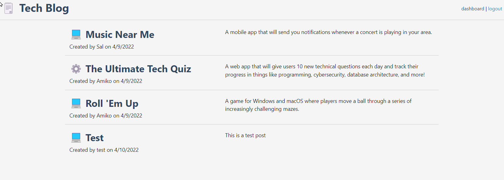
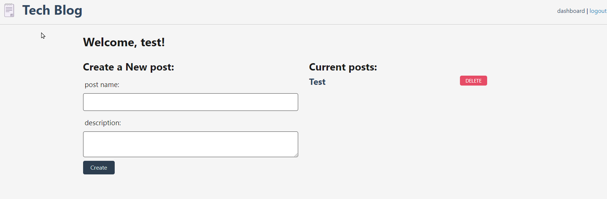

# Tech-Blog

## Description
    This project was designed for all techies to be able to have a place to go to blog ideas and comment on others post.

## Installation
   To run this source code you will have to have Node.js, and the following packages: dotenv.js, express, mysql2, sequelize, bcrypt, express-handlebars, express-session.
   * Heroku: https://cryptic-castle-12751.herokuapp.com/
   * GitHub: https://christopherponzio.github.io/Tech-Blog/
   * Repository: https://github.com/ChristopherPonzio/Tech-Blog

## Usage
    * To use this software you will need to add an env file with your password, username, and the database name of techblog_db
    * Once you open the file location in your terminal you will need to run "npm i" to install the needed packages. Aftwerwords mysql to upload the database. 
    * Once the database is uploaded you can use "npm run seeds" to add your stores specefic data from a seeds database.
    * Once your data base has been added you can use "npm start" to launch your server to test.
    * To use you will need to create a login. From there you will be able to see your post or create new post. 
    * If you click on a post you will be able to see comments or edit a post if needed.  

## Credits
    * Michelle Blackwell github: https://github/Mblackwellgca 
    * https://stackoverflow.com 
    * https://w3schools.com 
    * https://choosealicense.com 
    * https://img.shields.io
    * https://github.com
    * https://www.heroku.com

## License
    Licensed under the MIT license.
    https://choosealicense.com/licenses/mit